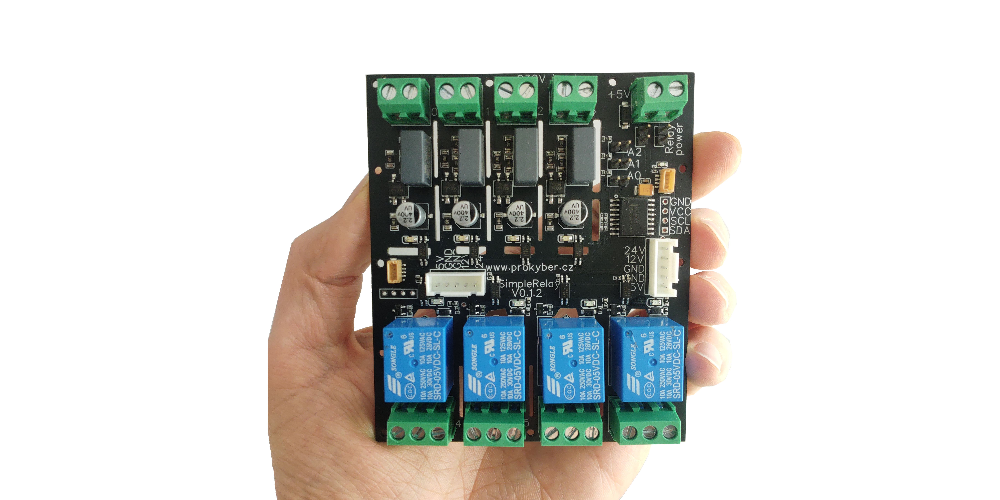

### PKIO230 Library
A simple example on to control PKIO230 4x230V input 4xRelay output I2C module using Arduino framework. Devboard used: [Ch32-Ant](https://www.tindie.com/products/allexok/ch32-ant-ch32v003-risc-v-board-with-stemma-qt/). 

